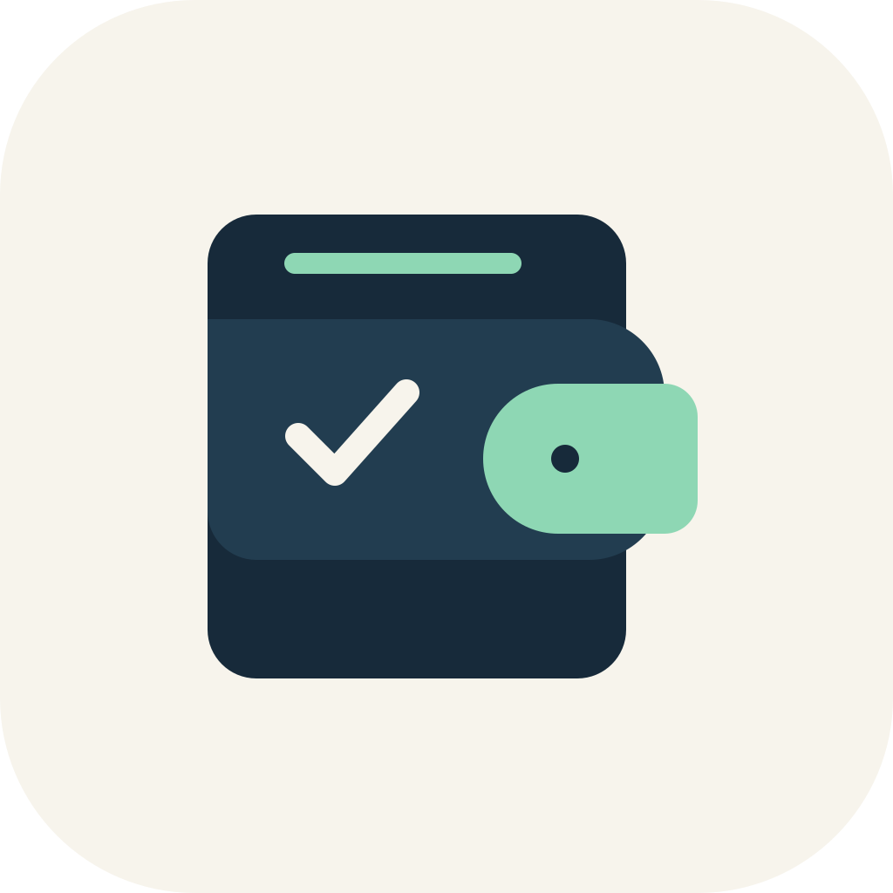

# 默迹（Moji）Android

<p align="center">
  
</p>

<p align="center"><strong>支付完成，账目已记。一个真正离线、没有账号和广告的 Android 自动记账工具。</strong></p>

默迹面向希望减少手动记账负担、同时不愿把消费记录交给云端服务的 Android 用户。它在用户明确授权后，从微信、支付宝的支付结果中提取必要信息，在本机完成解析、去重、分类和统计；识别不确定时保留人工确认与手动记账入口。

> Local First · 无需注册 · 无广告 · 数据默认不离开设备

## 它能做什么

- **支付后自动记账**：通过无障碍服务与可选的通知辅助识别支付结果。
- **快速校正**：支付后悬浮卡片可直接修改金额、商户、分类或撤销入账。
- **本地账本**：按月份浏览、左右滑动切月，并按时间、平台、来源和状态组合筛选。
- **自动分类**：可创建、编辑、停用和删除自己的商户分类规则。
- **统计与预算**：查看月度/年度趋势、分类支出和预算剩余。
- **可迁移数据**：支持本地 ZIP 备份恢复，以及 CSV、XLSX 导出。

## 适合谁

- 想尝试自动记账，但不希望注册账号或上传账本的人。
- 主要使用微信、支付宝消费，并愿意在本机授予相应系统权限的人。
- 喜欢 Local First、可审查、可自行构建软件的 Android 用户和开发者。

## 工作方式

```text
支付结果 / 通知
        ↓
本机解析与去重
        ↓
商户规则分类 ──→ 不确定时人工确认
        ↓
Room 本地账本、统计、预算与导出
```

## 当前版本

- 版本：`1.1.1`（versionCode 3）
- 最低 Android：7.0（API 24）
- 目标 Android：API 35
- 已完成华为真机链路验证：微信支付通知识别、未知商户自动入账、支付后悬浮卡片
- 悬浮卡片支持原地修改金额、商户和分类，以及撤销自动入账
- 账本支持时间、平台、来源、状态组合筛选和月份左右滑动
- 商户分类规则支持新增、查看、编辑、停用和删除

## 下载

从 [GitHub Releases](https://github.com/helh1723-lang/moji-android/releases/latest) 下载正式签名 APK。首次使用前请阅读应用内的权限说明；从早期 Debug 签名版本迁移时，需要先导出备份。

## 隐私边界

- 账本和规则保存在本地 Room 数据库中。
- 普通诊断记录不保存完整页面文本、金额、商户或订单号。
- “脱敏调试采样”仅在用户主动开启后的 24 小时内记录结构特征。
- 仓库不包含真实账本、设备采样、通知正文、签名密钥或本机配置。

## 构建

Windows 环境推荐使用项目提供的缓存安全脚本，它会将 Gradle 缓存放在 `D:\Gradle\ConnectPad`：

```powershell
.\gradlew-d.bat testDebugUnitTest lintDebug assembleDebug --no-daemon
```

APK 输出位置：

```text
app/build/outputs/apk/debug/app-debug.apk
```

正式 Release 构建需要仓库外部的签名配置。将环境变量 `MOJI_SIGNING_PROPERTIES` 指向包含
`storeFile`、`storePassword`、`keyAlias`、`keyPassword` 的本地属性文件，然后运行：

```powershell
.\gradlew-d.bat testReleaseUnitTest lintRelease assembleRelease --no-daemon
```

签名密钥和属性文件不得提交到仓库。

也可以使用标准 Gradle Wrapper；首次构建前需自行配置 Android SDK 的 `local.properties`，该文件不会提交到仓库。

## 从 GitHub 恢复

```powershell
git clone https://github.com/helh1723-lang/moji-android.git
cd moji-android
.\gradlew-d.bat assembleDebug --no-daemon
```

如果只需要安装包，可直接从 GitHub Releases 下载对应版本的 APK。

## 文档

- `默迹_Android自动记账APP_PRD.md`：产品需求与验收口径
- `docs/UI_DESIGN_SYSTEM.md`：界面设计系统

## 安全提醒

无障碍与通知访问均属于高敏感权限。安装后请只在理解用途并同意隐私披露的情况下开启；应用不会代替用户点击或发起支付。

## 开源许可证

本项目采用 [MIT License](LICENSE)。
